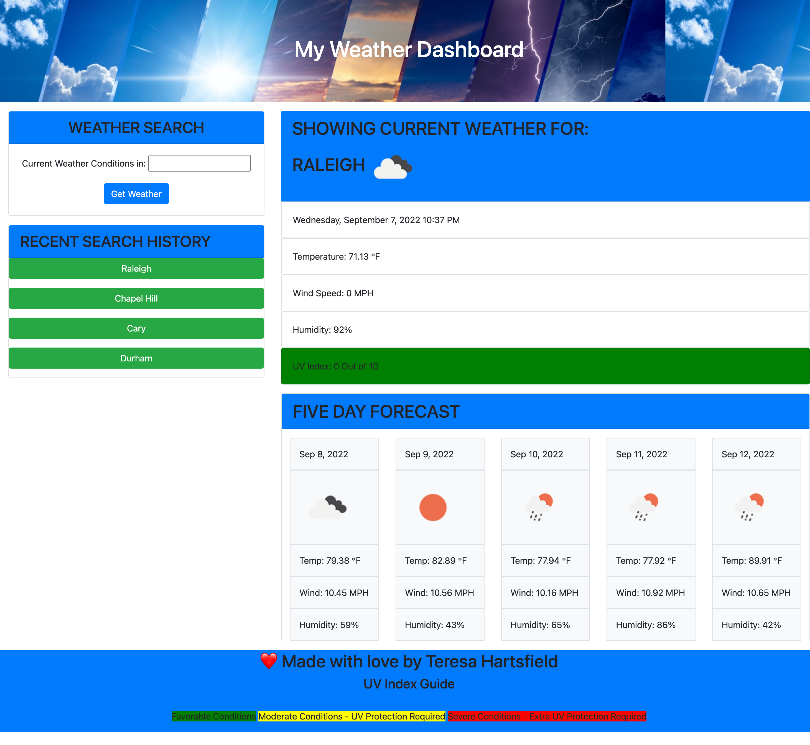

# My Weather Dashboard

## Purpose

To generated a weather outlook for multiple cities.

## Requirements

The user must be presented with:

- The current and future weather conditions for the requested city and that city is added to the search history.
- When the current city is presented, it must include; city name, the date, an icon representation of weather conditions, the temperature, the humidity, the wind speed, and the UV index.
- When viewing the UV index; then the user is presented with a color that indicates whether the conditions are favorable, moderate, and/or severe.
- When viewing the future weather, the user is presented with; a 5-day forecast that displays the date, an icon representation of weather conditions, the temperature, the wind speed, and the humidity.
- When a user clicks on a previously stored city, the user is presented with current and future conditions for that city.

## Website

https://hartsfieldt.github.io/changingtemps/

## Git Hub

https://github.com/hartsfieldt/changingtemps/

## Contribution

Made with ❤️ by Teresa Hartsfield
